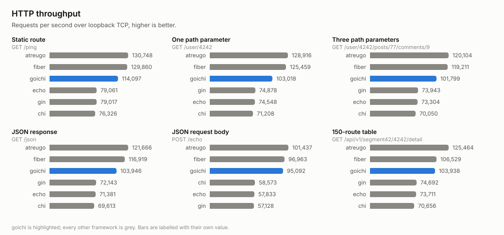
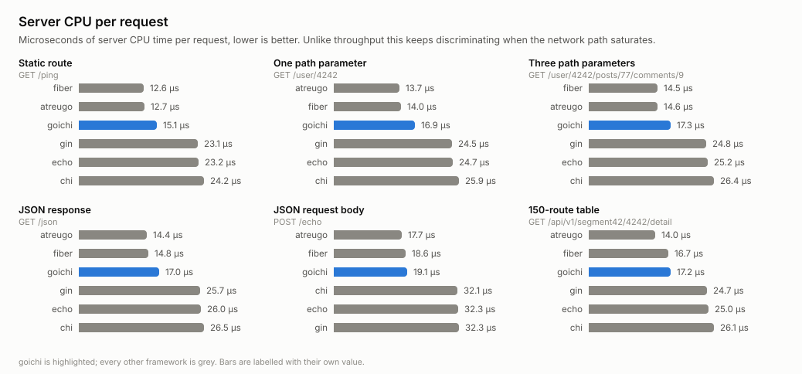

# goichi-bench

REST benchmark for [goichi](https://github.com/goichi-dev/goichi), measured
against **gin**, **fiber**, **chi**, **echo** and **atreugo** on identical
routes — and the regression gate that says whether a change to goichi cost
anything.

This repository exists because a framework that calls itself high-performance
owes the reader numbers, and because the numbers have to be reproducible by
somebody who does not trust the author.

> Only the REST/HTTP surface is measured. goichi's WebSocket, GraphQL, gRPC and
> MQTT protocols are out of scope here.

## What is measured

Six scenarios, issued identically to every framework:

| scenario | request | what it exercises |
|---|---|---|
| `static` | `GET /ping` | dispatch with no parameters, plain-text body |
| `param` | `GET /user/:id` | one captured parameter, JSON body |
| `params3` | `GET /user/:id/posts/:pid/comments/:cid` | deep tree walk, three captures |
| `json` | `GET /json` | serialising a fixed six-field struct |
| `post` | `POST /echo` | binding a JSON request body, then writing it back |
| `many` | `GET /api/v1/segment42/:id/detail` | matching inside a 150-route table |

Two phases produce two kinds of number:

- **HTTP phase** — a real server on loopback TCP, driven by a fasthttp load
  generator: throughput, latency percentiles, and **server CPU time per
  request**.
- **In-process phase** — the framework's own handler called directly, with no
  sockets: **nanoseconds and heap allocations per request**.

## Results

Measured 2026-08-13 on an idle Linux server — Xeon E3-1230 v6 (4 cores,
hyper-threading off, governor pinned to `performance`), Ubuntu 24.04, Go 1.26.4.
goichi v0.2.0, fiber v3.4.0, gin v1.12.0, echo v4.15.4, chi v5.3.1, atreugo
v11.13.2. Raw run: [`results/linux-v0.2.0.json`](results/linux-v0.2.0.json).



Requests per second, median of three measured windows, every framework passing
the correctness gate with zero errors:

| scenario | atreugo | fiber | goichi | gin | echo | chi |
|---|---|---|---|---|---|---|
| `static` | 130,748 | 129,860 | **114,098** | 79,017 | 79,062 | 76,327 |
| `param` | 128,916 | 125,460 | **103,018** | 74,879 | 74,549 | 71,208 |
| `params3` | 120,105 | 119,211 | **101,800** | 73,943 | 73,304 | 70,051 |
| `json` | 121,666 | 116,919 | **103,947** | 72,144 | 71,382 | 69,613 |
| `post` | 101,438 | 96,964 | **95,093** | 57,128 | 57,833 | 58,574 |
| `many` | 125,464 | 106,529 | **103,938** | 74,693 | 73,712 | 70,657 |

The frameworks separate into two groups, and the split is the HTTP stack rather
than the router: atreugo and fiber sit on fasthttp, gin, echo and chi sit on
`net/http`, and goichi — also on `net/http` — lands between them, 38–66% above
the other `net/http` routers on every scenario and 1.9–17.9% below fiber. On
`post` the gap to fiber is 1.9%, which is inside the run-to-run drift measured
below; on `static` it is 12.1%, which is not.



Throughput on loopback is bounded by the socket as much as by the framework, so
the server's own CPU time per request is the figure that keeps separating them
after the network path stops:

| µs of server CPU per request | `static` | `params3` | `post` |
|---|---|---|---|
| fiber | 12.6 | 14.5 | 18.6 |
| atreugo | 12.7 | 14.6 | 17.7 |
| **goichi** | **15.1** | **17.3** | **19.1** |
| gin | 23.1 | 24.8 | 32.3 |
| echo | 23.2 | 25.2 | 32.3 |
| chi | 24.2 | 26.4 | 32.1 |

### What v0.2.0 changed

goichi v0.2.0 stopped copying the parameter map on every candidate branch while
matching. The same six scenarios, same host, v0.1.0 against v0.2.0:

| scenario | v0.1.0 | v0.2.0 | | allocs/op |
|---|---|---|---|---|
| `params3` | 84,322 | 101,800 | **+20.7%** | 16 → 5 |
| `many` | 87,485 | 103,938 | **+18.8%** | 22 → 5 |
| `post` | 86,594 | 95,093 | +9.8% | 7 → 5 |
| `json` | 95,669 | 103,947 | +8.7% | 7 → 3 |
| `param` | 97,370 | 103,018 | +5.8% | 8 → 5 |
| `static` | 111,896 | 114,098 | +2.0% | 4 → 2 |

The gain lands where the change predicts it should: the routes that capture the
most parameters gain the most, and `static` — which never touched the parameter
map — barely moves. A result shaped the other way round would have meant the
measurement, not the router, had changed.

Both runs are in `results/`, so the verdict can be re-derived without measuring
anything:

```bash
go run ./cmd/compare -base results/linux-v0.1.0.json -new results/linux-v0.2.0.json
```

### How much of this is noise

The v0.1.0 and v0.2.0 runs measured all six frameworks, so the five whose code
did not change between them are a control group for the host itself:

| `static`, unchanged frameworks | v0.1.0 run | v0.2.0 run | drift |
|---|---|---|---|
| atreugo | 130,131 | 130,748 | +0.5% |
| fiber | 128,721 | 129,860 | +0.9% |
| gin | 79,558 | 79,017 | −0.7% |
| echo | 77,997 | 79,062 | +1.4% |
| chi | 75,035 | 76,327 | +1.7% |

Across all six scenarios those five frameworks drift by at most 2.9% between the
two runs, a median of 0.8%, and the spread inside a single run is ±0.3–4.6%
(median ±1.4%). Differences smaller than that are not differences — which is why
the 1.9% between goichi and fiber on `post` is reported as a tie and the 20.7%
on `params3` is not.

The host is not otherwise idle: it runs a Kubernetes control plane and a
Prometheus instance that together hold about 7% of its CPU throughout. That
background is the same for every framework and it is included in the drift
figures above, but it is a reason to reproduce these numbers rather than trust
them.

### In-process figures

The in-process phase measures allocations, and there goichi's `post` path is the
lightest in the comparison — 5 allocations per request against fiber's 9 and
gin's 14. Its nanoseconds-per-operation figures, however, are the slowest here
(855 ns on `static` against fiber's 115 ns), which is not consistent with its
HTTP result and should not be read as a cross-framework ranking: the phase calls
each framework's own handler through each framework's own request object, and
those are not the same object. Its job is to compare a framework against its own
past, which is what the table above uses it for.

Charts and the HTML report are generated into `docs/` by `cmd/report`, and the
raw measurements land in `results/`, one JSON file per run.

## Running it

```bash
go run ./cmd/goichi-bench -out results/latest.json   # measure (~13 min)
go run ./cmd/report -in results/latest.json -out docs # render charts + report
```

Useful flags:

| flag | default | meaning |
|---|---|---|
| `-frameworks` | all | comma-separated subset, e.g. `goichi,fiber` |
| `-phase` | `all` | `http` or `micro` to run one phase |
| `-connections` | `64` | concurrent connections in the HTTP phase |
| `-duration` | `5s` | measured window per scenario |
| `-repeat` | `3` | measurements per scenario; the median is kept |
| `-benchtime` | `1s` | measured window per in-process benchmark |

The run exits non-zero if any framework fails the correctness gate.

## The regression gate

Record a baseline, change goichi, measure again, and let the exit code decide:

```bash
go run ./cmd/goichi-bench -out results/baseline.json
# ... change goichi ...
go run ./cmd/goichi-bench -out results/latest.json
go run ./cmd/compare -base results/baseline.json -new results/latest.json
```

Allocation and byte counts are deterministic, so they are allowed to move **0%**
— one extra allocation per request is a regression and is reported as one.
Timings are noisy, so they get a tolerance (`-tolerance`, default 15%; tail
latency gets double). `compare` exits non-zero when anything regresses.

## Benchmarking unreleased goichi

`go.mod` pins the published goichi release, so a fresh clone reproduces the
published numbers. To measure a working tree instead:

```bash
go mod edit -replace github.com/goichi-dev/goichi=../goichi
go run ./cmd/goichi-bench -frameworks goichi -out results/goichi-dev.json
go mod edit -dropreplace github.com/goichi-dev/goichi
```

## How the comparison is kept honest

**Every framework returns the same bytes.** Before any timing, each server is
asked every scenario once and its response is compared against a fixed expected
body. A framework that answers something shorter, or with a different status,
fails the gate and the run fails with it — being fast by doing less is not
available.

**Each framework is used the way its own documentation shows.** Its own router
syntax, its own JSON writer, its own request binder, and whatever middleware it
installs by default. Where a framework does more work per request because that
is what it ships, the cost is counted: that is what its users actually pay.

**One framework per process, one at a time.** No two frameworks share a heap, a
garbage collector or a scheduler. The load generator is pinned to half the
machine's cores and the server to the other half, so neither starves the other.

**The median of repeated measurements**, with the spread between fastest and
slowest repeat recorded next to it. A difference smaller than that spread is
not a difference.

**Server CPU time per request is measured, not inferred.** The orchestrator
reads the server process's own CPU counters around the measured window
(`GetProcessTimes` on Windows, `/proc/<pid>/stat` on Linux). This matters
because a loopback interface saturates before a modern Go router does: once
every framework is bounded by the same network path they report almost the same
throughput, while CPU per request keeps separating them.

**Latency is measured with a clock that can see it.** On Windows `time.Now()`
advances in steps of about half a millisecond — longer than the request being
timed — so percentiles taken from it collapse into "0 ms" and "1 ms". The load
generator uses `QueryPerformanceCounter` there instead.

**The system timer period is pinned for the length of the run.** Windows wakes a
waiting thread on a timer whose period defaults to 15.625 ms, and the Go runtime
raises it to 1 ms only while it has timers to service, dropping it again when
the process goes briefly idle — so which period is in force during a measurement
is decided by unrelated activity on the machine. A measurement that straddles a
drop sees requests wait for the next tick: throughput falls by a factor of
three, tail latency lands exactly on 15.6 ms, and CPU time per request does not
move at all, because the work per request never changed and only the waiting
grew. Unpinned, one framework measured anywhere between 40k and 180k req/s
within a single run, a gap far wider than any real difference between the
frameworks. The orchestrator now holds the finest period from start to finish
and records it in the result file, so a run made without it can be recognised
later.

## What these numbers do not say

- **Throughput here is a floor, not a ceiling.** Client and server share one
  machine; on a saturated loopback the frameworks bunch together.
- **The in-process phase compares a framework with its own past first.** Across
  stacks it also compares two different request objects: a fasthttp
  `RequestCtx` is not a `net/http` `Request`, and that difference is inside the
  measurement.
- **atreugo has no in-process figures.** It keeps its `fasthttp.RequestHandler`
  unexported, so it can only be driven through a real listener. It takes part
  in the HTTP phase and is reported as `n/a` in the in-process one.
- **One machine, one operating system.** Numbers measured elsewhere are not
  comparable to these. Re-run the suite on the host you care about.

## Layout

```
cmd/goichi-bench   orchestrator: runs every framework, writes the result JSON
cmd/report         result JSON -> SVG charts + HTML report
cmd/compare        two result JSONs -> regression verdict
cmd/worker         serves, or measures, exactly one framework (spawned)
internal/apps      one REST application per framework, identical routes
internal/loadgen   HTTP load generator and latency histogram
internal/micro     in-process measurement
internal/procstat  another process's CPU time
internal/clock     a monotonic clock fine enough to time one request
internal/chart     SVG charts and the HTML report
```

## License

MIT — see [LICENSE](LICENSE).
